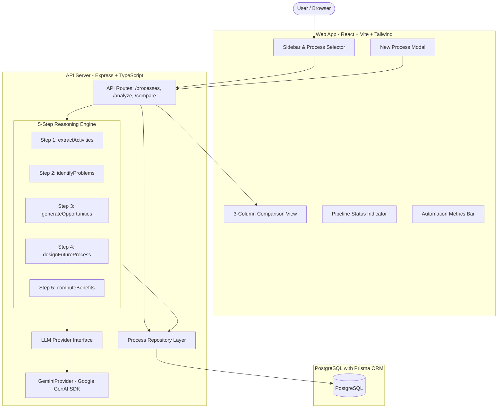

# FutureFlow AI — System Architecture

## Overview
FutureFlow AI is an enterprise process intelligence engine that transforms manual workflows into AI-augmented future processes through a verifiable, traceable multi-step reasoning pipeline.

## Traceability & Structured Output Guarantee
1. **Separation of Steps**: Instead of a monolithic prompt, each reasoning step is an isolated function validated with Zod schemas.
2. **Technological Rigor & Taxonomy**: Steps are classified into 5 distinct categories:
   - `AI`: Probabilistic cognition, computer vision defect detection, GenAI document synthesis.
   - `Automation`: Deterministic ERP database syncs, barcode scanning, rule-based range checks.
   - `Robotics`: Physical material transfer (AMR/AGVs, robotic manipulators).
   - `Hybrid`: Collaborative human-in-the-loop workflows (human exception approval).
   - `Human`: Regulatory sign-offs and discretionary decisions.
3. **Traceable FK Linkage**: Opportunities in Step 3 explicitly reference foreign keys (`activityId`) created in Step 1.
4. **Conservative Benefit Modeling**: Benefit cards require explicit confidence ratings (`Low` / `Medium` / `High`) and list mandatory baseline operational data required for exact dollar/hour ROI quantification.

## Scoring Methodology
- **Automation Score Formula**:
  $$\text{Automation Score} = \frac{\text{AI} \times 1.0 + \text{Automation} \times 1.0 + \text{Robotics} \times 1.0 + \text{Hybrid} \times 0.5}{\text{Total Future Steps}} \times 100$$
- **Interpretation**: A model-derived index representing structural delegation of process responsibilities across the redesigned workflow, distinguished from empirical time-motion labor measurements.
