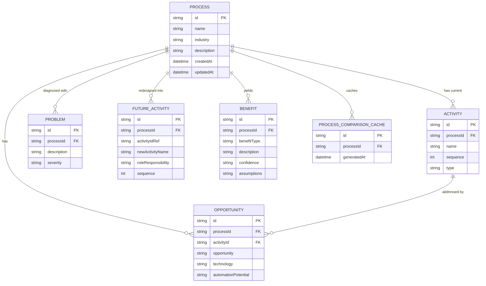

# FutureFlow AI — Data Model & ER Diagram

## Entity Relationship Diagram

## Schema Justification
- **Traceability**: `Opportunity.activityId` maps every AI innovation directly to the source manual step.
- **Responsibility Classification**: `FutureActivity.roleResponsibility` is strictly enforced as `human | ai | hybrid`.
- **Relational Integrity**: Foreign key constraints and cascade deletes ensure clean re-runs without orphaned entities.
